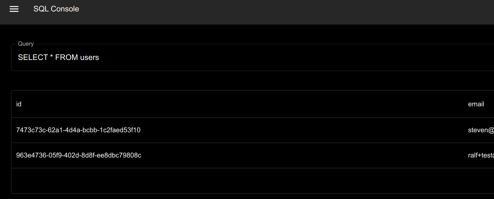

# Diagnostics app

This diagnostics app presents data from the perspective of a specific user (no server-side stats) and can be used to:

- See stats about the user's local database.
- Inspect tables and sync buckets on the device.
- Identify common issues. E.g. too many sync buckets.
- Get started quickly - play around with a SQLite database without creating an app.
- Serve as a baseline to compare your own apps against if you run into issues such as slow sync.

The app is currently available as a local standalone web app, and is largely based on the [web SDK](/packages/web/).

## Running the app

In the root of the repository, run:

```sh
pnpm install
pnpm build:packages
```

Then in this directory run:

```
pnpm dev
```

Generate a [development token](https://docs.powersync.com/usage/installation/authentication-setup/development-tokens) and sign in. For development tokens, the PowerSync endpoint should be populated automatically. For some others like Supabase tokens, it needs to be entered manually.

**Note**: Please see the known usability issues listed below.

## Functionality

### Database stats

Details about the user's local database:


### Detected tables

This only includes tables with synced data (tables with 0 synced rows won’t be present):


### Sync buckets


Similar to tables above, this only includes buckets with synced data.
When syncing large amounts of data:

- Total operations is calculated from the checkpoint, will be populated quickly.
- Other stats are populated as the data is downloaded, so this may take a while.

### SQL console

Same functionality as in the other demo apps:



### Dynamic schema [internal]

The schema is required for some functionality, and is dynamically generated and automatically updated from downloaded data. The schema used is displayed in a separate page:


If a table has 0 synced rows, it won’t be present in the schema, and queries referencing it will fail.

Tables and columns are only added to this schema - nothing is automatically removed when removed from sync rules. To refresh the schema, use the “Clear & Redownload” button on the main page.

## Known issues

At this stage, we recommend running the app with the dev console open, as some errors are currently not being surfaced to the UI, including:

- No errors are displayed when the token is invalid, or when it expires later.
  - The user is also “logged in” to the app with an invalid token after an initial delay
- If the query in the SQL console contains an error, nothing is displayed.

Other known issues:

- When signed out, there is no automatic redirect to the login page.
- When a lot of data is synced, the main dashboard may be slow.
