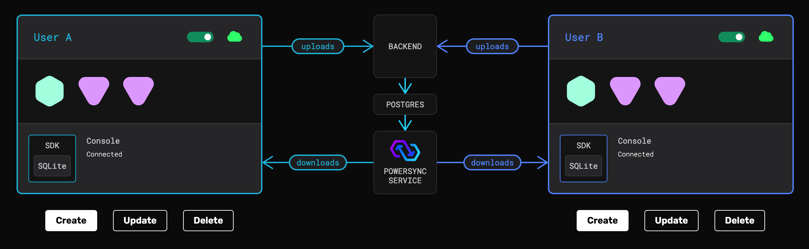

# PowerSync + Supabase Web Demo: Multi Client

This is a demo of the widget displayed on the [PowerSync homepage](http://powersync.com) and demonstrates how data flows from one PowerSync client to another. It also includes an implementation of Supabase's [anonymous auth](https://supabase.com/docs/guides/auth/auth-anonymous) feature.



## Webflow Devlink Components

Note that some of the UI components are generated from elements created in (Webflow's Devlink)[https://webflow.com/devlink]. They can be found under `src/devlink`. To make it easier to modify this project, these generated components are wrapped in facade components. The implementation detail of the facades can easily be changed to your own version that doesn't depend on devlink.

## Setup Instructions

Note that this setup guide has minor deviations from the [Supabase + PowerSync integration guide](https://docs.powersync.com/integration-guides/supabase-+-powersync). Below we refer to sections in this guide where relevant.

### 1. Install dependencies

In the repo directory, use [pnpm](https://pnpm.io/installation) to install dependencies:

```bash
pnpm install
pnpm build:packages
```

### 2. Create project on Supabase and set up Postgres

This demo app uses Supabase as its Postgres database and backend:

1. [Create a new project on the Supabase dashboard](https://supabase.com/dashboard/projects).
2. Go to the Supabase SQL Editor for your new project and execute the SQL statements in [`database.sql`](database.sql) to create the database schema, row level security (RLS) rules, and publication needed for PowerSync.

### 3. Auth setup

For ease of demoing, this app uses Supabase's [anonymous sign-in](https://supabase.com/docs/guides/auth/auth-anonymous) feature.
Ensure that it is enabled under "Project Settings" -> "Authentication" in Supabase and confirming `Allow anonymous sign-ins` is toggled on. Click "Save" if you toggled this setting.

The RLS rules defined in the `database.sql` script are setup to only allow the anonymous user CRUD access to their pebbles.

### 4. Create new project on PowerSync and connect to Supabase

Follow the [Connect PowerSync to Your Supabase](https://docs.powersync.com/integration-guides/supabase-+-powersync#connect-powersync-to-your-supabase) section.

### 5. Create Sync Rules on PowerSync

Create sync rules by following the [Configure Sync Rules](https://docs.powersync.com/integration-guides/supabase-+-powersync#configure-sync-rules) section.
The sync rules for this demo are defined in [`sync-rules.yaml`](sync-rules.yaml) in this directory. Copy its contents and paste it into the 'sync-rules.yaml' file in the Dashboard as described in the guide.

### 6. Set up local environment variables

To set up the environment variables for the demo app, copy the `.env.local.template` file:

```bash
cp .env.local.template .env.local
```

And then edit `.env.local` to insert your credentials for Supabase and PowerSync.

### 8. Run the demo app

In this directory, run the following to start the development server:

```bash
pnpm dev
```

Open [http://localhost:5173](http://localhost:5173) with your browser to try out the demo.
