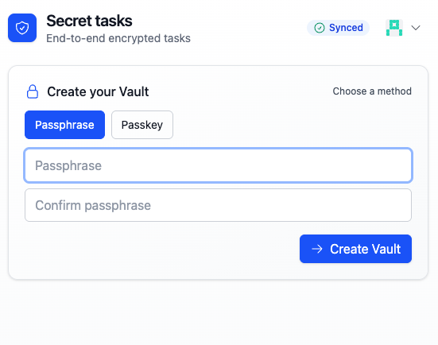

# PowerSync E2EE Monorepo

This repo contains examples and libraries for building end‑to‑end encrypted apps on top of PowerSync.

## App

- [packages/todo-raw-table](packages/todo-raw-table) — "Todo (raw-table + encrypted mirrors)"

### Links

- Todo (raw-table + mirrors): [packages/todo-raw-table](packages/todo-raw-table)

## Crypto packages

- [packages/crypto/interface](packages/crypto/interface)
  - Shared types and helpers (`CipherEnvelope`, base64 helpers, etc.) used by crypto providers.
- [packages/crypto/encrypted-sqlite](packages/crypto/encrypted-sqlite)
  - Generic encrypted↔mirror runtime for SQLite/PowerSync: pair configs, `ensurePairsDDL`, `startEncryptedMirrors`, `insertEncrypted`/`updateEncrypted`/`deleteEncrypted`, and hooks.
- [packages/crypto/password](packages/crypto/password)
  - Password-based crypto provider (PBKDF2 by default) implementing the `CryptoProvider` interface for wrapping/unwrapping DEKs.
- [packages/crypto/webauthn](packages/crypto/webauthn)
  - WebAuthn-based crypto provider using PRF/hmac-secret extensions to derive a stable secret per credential (wrap/unwrap DEKs using passkeys).

Each app consumes these packages to implement E2EE in the browser and keep ciphertext opaque to the PowerSync backend.
