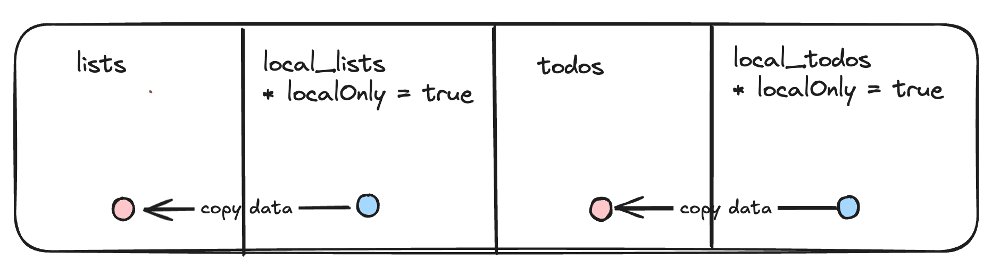
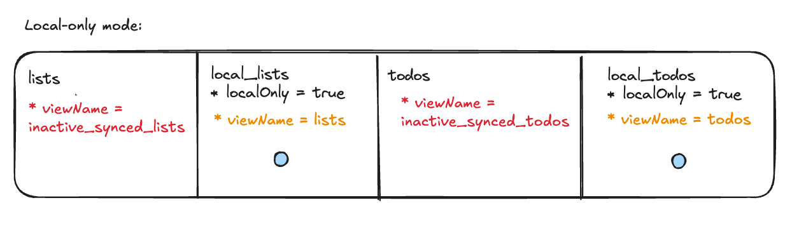
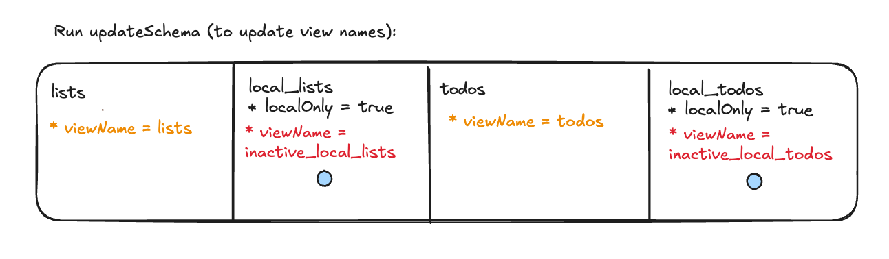
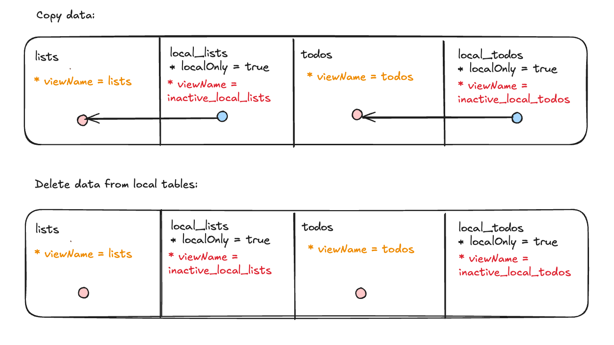

# PowerSync + Supabase Web Demo: Todo List Optional Sync

## Overview

This demo app is an extension of the [React Supabase Todo List Demo](../react-supabase-todolist/README.md) and demonstrates using the [PowerSync SDK for Web](https://www.npmjs.com/package/@powersync/web) to persist data locally without syncing. This lets users use the app without having to register or sign in. It then demonstrates syncing this data to Supabase once the user registers at a later stage.

The recommended flow through this demo is:

1. Run the app in local-only mode and create data. Notice how data persists even when closing and reopening the app.
2. Enable user registration and sign in to the app.
3. Notice how previously created data now seamlessly syncs with Supabase.

For an overview of the mechanics behind this, see [the explanation further below](#how-this-works).

# Run the app in local-only mode

In the repo directory, use [pnpm](https://pnpm.io/installation) to install dependencies:

```bash
pnpm install
pnpm build:packages
```

Then switch into the demo's directory:

```bash
cd demos/react-supabase-todolist-optional-sync
```

Run the development server:

```bash
pnpm dev
```

Open [http://localhost:5173](http://localhost:5173) with your browser to see the result.

Create some data and notice how the data persists after a refresh or reopening the app.

It is expected that users cannot register or sign in at this stage.
This is because Supabase and PowerSync credentials have not been been configured yet -- there is a hardcoded check in `SupabaseConnector.ts` for this. We'll get to this next.

# Enable user registration and sign in

Create Supabase and PowerSync projects, and add their credentials to `.env` to enable user registration and sign in.

## Set up your Supabase project

Detailed instructions for integrating PowerSync with Supabase can be found in [the integration guide](https://docs.powersync.com/integration-guides/supabase-+-powersync). Below are the main steps required to get this demo running.

Create a new Supabase project, and paste an run the contents of [database.sql](./database.sql) in the Supabase SQL editor.

It does the following:

1. Create `lists` and `todos` tables.
2. Create a publication called `powersync` for `lists` and `todos`.
3. Enable row level security, allowing users to only view and edit their own data.
4. Create a trigger to populate some sample data when an user registers.

## Configure your PowerSync Instance

Create a new PowerSync instance, connecting to the database of the Supabase project. See instructions [here](https://docs.powersync.com/integration-guides/supabase-+-powersync#connect-powersync-to-your-supabase).

Then deploy the following sync rules:

```yaml
bucket_definitions:
  user_lists:
    # Separate bucket per todo list
    parameters: select id as list_id from lists where owner_id = request.user_id()
    data:
      - select * from lists where id = bucket.list_id
      - select * from todos where list_id = bucket.list_id
```

## Configure the app

Set up the Environment variables: Copy the `.env` file:

```bash
cp .env .env.local
```

Insert the credentials of your Supabase and PowerSync projects into `.env.local`.

## Sign in to the app

Restart the app and sign up or sign in. Once successfully signed in, existing and new data should seamlessly sync with Supabase.

# How this works

This app uses [local-only](https://powersync-ja.github.io/powersync-js/web-sdk/classes/Table#localonly) tables to persist data until the user has registered or signed in. Local-only tables do not log updates in the upload queue, avoiding any overhead or growth in database size.

Once the user registers, the data is moved over to synced tables. The move operation also places the data in the upload queue.

## Naive implementation

A barebones way to achieve the above is to store and query data from local-only tables before user registration, copy this data to each corresponding synced table after registration and then store and query from the synced tables. This would look as follows:



The downside to this approach is that app queries would need to continuously differentiate between the two tables based on whether the user signed in or not.

## Recommended implementation

To keep app queries consistent between the two states, we utilize the [viewName](https://powersync-ja.github.io/powersync-js/web-sdk/classes/Table#viewname) property (table definitions in the PowerSync client schema actually create views and this property lets us override the view name - see the [client architecture docs](https://docs.powersync.com/architecture/client-architecture)).

This looks as follows in the local-only state:



The local-only tables (`local_lists` and `local_todos`) have their view names overriden to `lists` and `todos`, and these names are used in queries (e.g. `PowerSync.getAll("SELECT * FROM lists");`). The `lists` and `todos` tables, which are the sync-enabled tables without the `localOnly` flag, are not used at this stage, as indicated by their `inactive_synced_` view names.

When the user registers / signs in:



The _synced_ tables (`lists` and `todos`) now have their view names set to `lists` and `todos`. Note that `updateSchema` must be run to update the view name. See the [schema](./src/library/powersync/AppSchema.ts) for details about this. The app query `PowerSync.getAll("SELECT * FROM lists")` now reads data from the `lists` table.

Finally, copy data from the local-only tables to the synced tables, and delete data from the local-only tables to reduce database size:



Note:
If the user now signs out, all data is cleared, effectively resetting the app to the initial local-only state. To manage this, an additional local storage mechanism is used to track which schema is currently in use, as seen [here](./src/library/powersync/SyncMode.ts).

# Limitations

- `updateSchema` cannot be called inside a transaction, and it's recommended to perform the schema update when the database isn't connected.

## Progressive Web App (PWA)

This demo is PWA compatible, and works fully offline. PWA is not available in development (watch) mode. The manifest and service worker is built using [vite-plugin-pwa](https://vite-pwa-org.netlify.app/).

Build the production codebase:

```bash
pnpm build
```

Run the production server:

```bash
pnpm preview
```

Open a browser on the served URL and install the PWA.

## Learn More

Check out [the PowerSync Web SDK on GitHub](https://github.com/powersync-ja/powersync-js/tree/main/packages/web) - your feedback and contributions are welcome!

To learn more about PowerSync, see the [PowerSync docs](https://docs.powersync.com).
