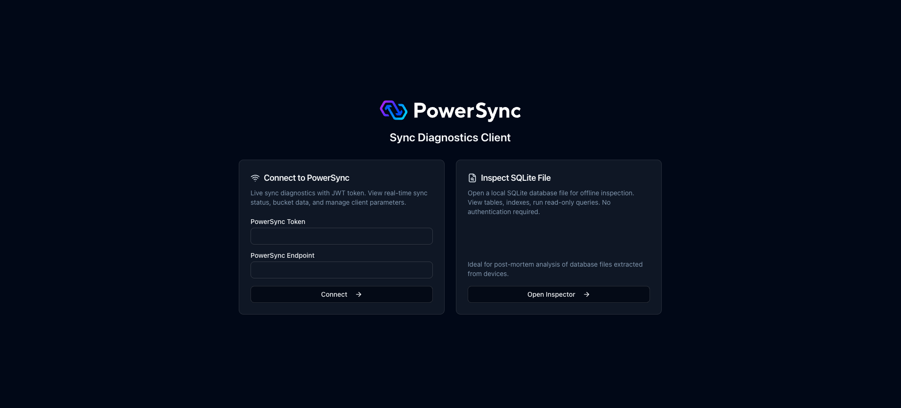
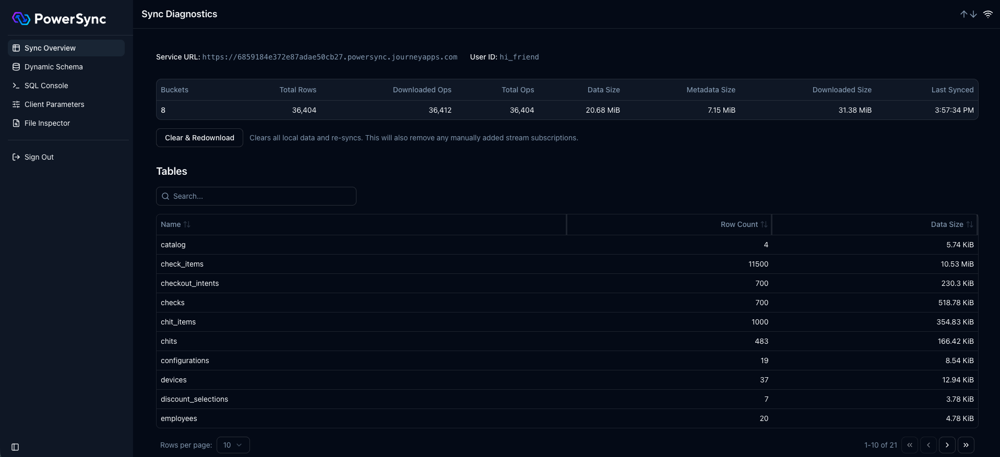
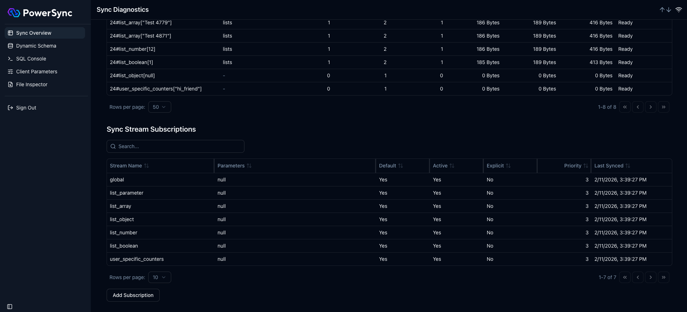
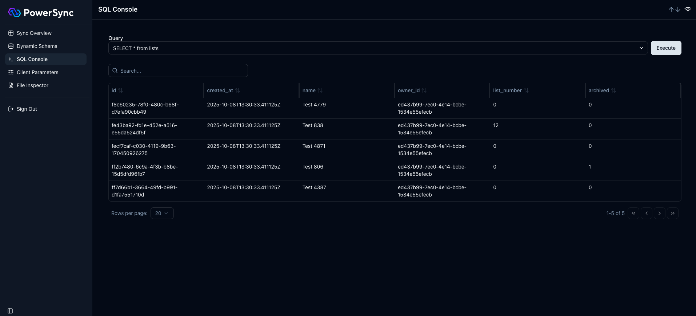
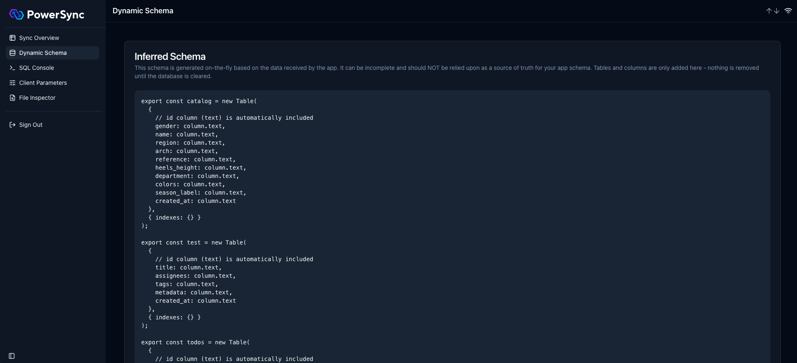
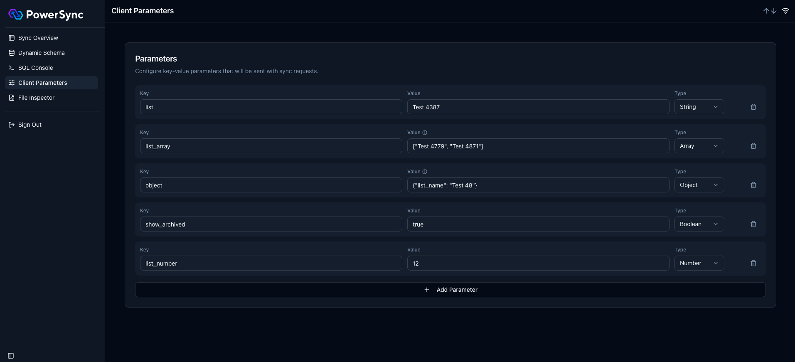
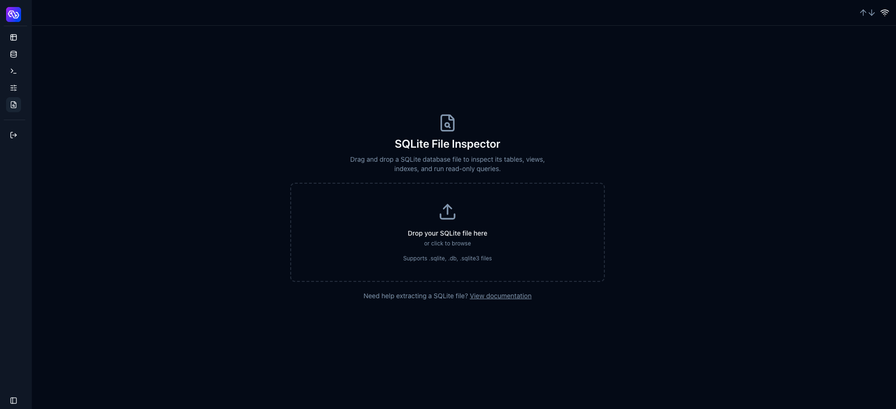
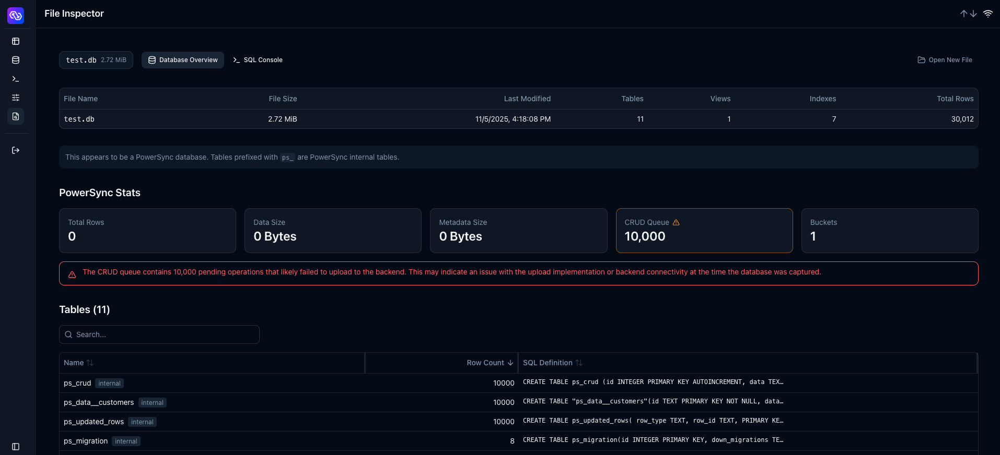
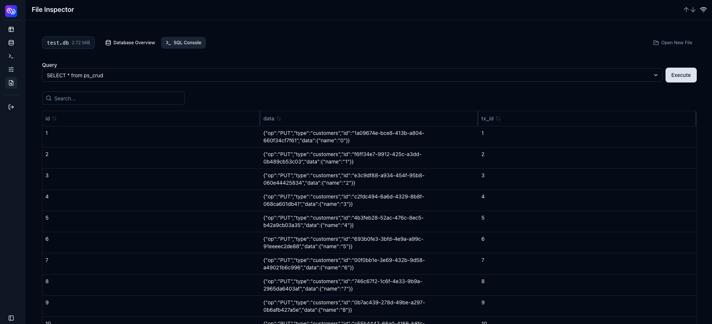

# Sync Diagnostics Client

A browser-based tool for inspecting PowerSync databases. Both live (via sync) and offline (via SQLite file upload).

The app is available at [https://diagnostics-app.powersync.com/](https://diagnostics-app.powersync.com/)

It can also be run as a local standalone web app, and is based on the [web SDK](/packages/web/).

## Running the App

### Docker

```sh
docker run --pull always -p 8082:80 journeyapps/powersync-diagnostics-app
```

The app will be available on http://localhost:8082.

### Local Development

In the root of the repository, run:

```sh
pnpm install
pnpm build:packages
```

Then in this directory:

```sh
pnpm dev
```

The app is now available on [http://localhost:5173/](http://localhost:5173/).

## Getting Started

The landing page offers two paths:



- **Connect to PowerSync**: Live sync diagnostics using a JWT token. View real-time sync status, bucket data, and manage client parameters.
- **Inspect SQLite File**: Offline inspection of a local `SQLite` file. No authentication required.

---

## Connect to PowerSync

Connecting as a user requires a **PowerSync Token (JWT)** and **Endpoint**.

### PowerSync Token

Generate a [development token](https://docs.powersync.com/usage/installation/authentication-setup/development-tokens) for the user.

### PowerSync Endpoint

For PowerSync development tokens, the endpoint is populated automatically from the JWT. For other JWTs (e.g. Supabase tokens), enter it manually.

- **PowerSync Cloud**: Use your instance URL.
- **Self-hosted (Docker)**: The internal Docker URL won't be reachable from outside the network. Use the endpoint as exposed by docker-proxy, e.g. `http://localhost:8080`.

You can also deep-link directly with a `?token=` query parameter to auto-sign-in.

### Sync Overview

The main dashboard after connecting:



- **Summary stats**: Bucket count, total rows, downloaded/total operations, data size, metadata size, last synced time.
- **Tables**: All synced tables with row count and data size.
- **Buckets**: Per-bucket breakdown including download progress, operation counts, and status.
- **Clear & Redownload**: Clears all local data and re-syncs from the server.
- **Compacting alert**: Shown when total operations significantly exceed total rows, indicating bucket history has accumulated.

### Sync Stream Subscriptions



Manage sync stream subscriptions directly from the Sync Overview page:

- View all active stream subscriptions with their parameters, priority, sync time, and eviction time.
- **Add Subscription**: Subscribe to a new stream with optional parameters and priority.
- **Unsubscribe**: Remove explicit subscriptions (triggers a reconnect to apply the change).

### SQL Console



Execute read-only SQL queries against the live PowerSync database:

- Query history is persisted across sessions.
- Large result sets are automatically limited to 10,000 rows to prevent UI freezes.
- Results are displayed in a searchable, sortable, paginated table.

### Dynamic Schema



The schema is dynamically inferred from downloaded data and automatically updated as new data arrives. This page displays the current inferred schema for reference.

Note: Tables with 0 synced rows won't appear in the schema. To refresh after sync rule changes, use "Clear & Redownload" on the Sync Overview page.

### Client Parameters



Manage client parameters that are sent with sync requests:

- Add, edit, and delete key-value parameters.
- Supports string, number, boolean, array, and object types.
- Changes trigger an automatic reconnect after a short debounce.

---

## SQLite File Inspector

The File Inspector allows offline inspection of SQLite database files. It is useful for post-mortem analysis of database files extracted from devices. No authentication is required.

### Opening a File



Drag and drop a `SQLite` file, or click to browse. The file is opened in-browser using wa-sqlite - nothing is uploaded to a server.

### Database Overview



- **File info**: File name, size, last modified date.
- **Database structure**: Tables, views, indexes, and triggers with their SQL definitions and row counts.
- **PowerSync stats**: If the file is a PowerSync database (contains `ps_` tables), aggregate stats are shown: total rows, data/metadata size, CRUD queue, bucket count. Warnings are shown for pending CRUD entries (failed uploads) or when compacting is recommended.

### SQL Console



Execute read-only SQL queries against the uploaded file. Works the same as the sync SQL console, with separate query history.

---

## Known Issues

- Having the app open in multiple tabs may cause issues.
- When syncing large amounts of data, the dashboard may be slow while operations are being downloaded.
